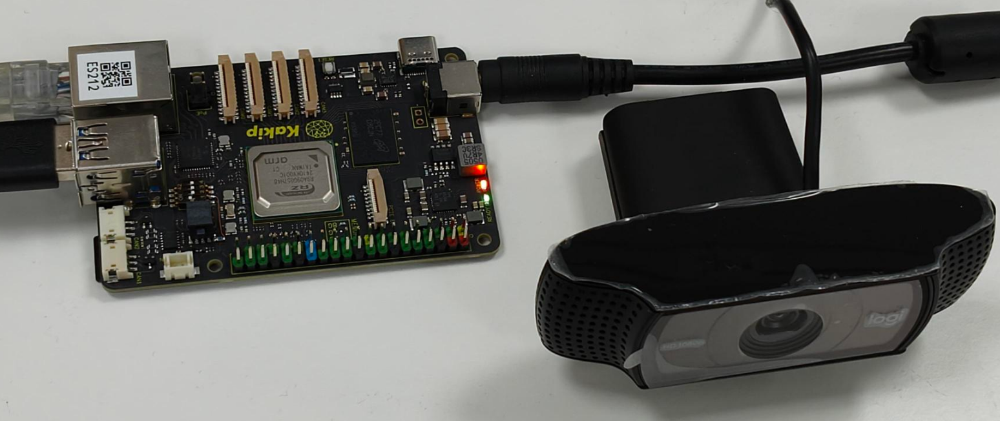
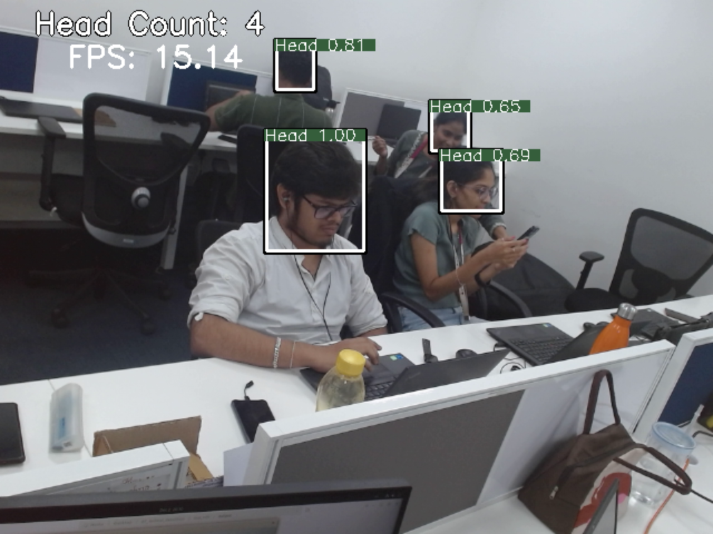
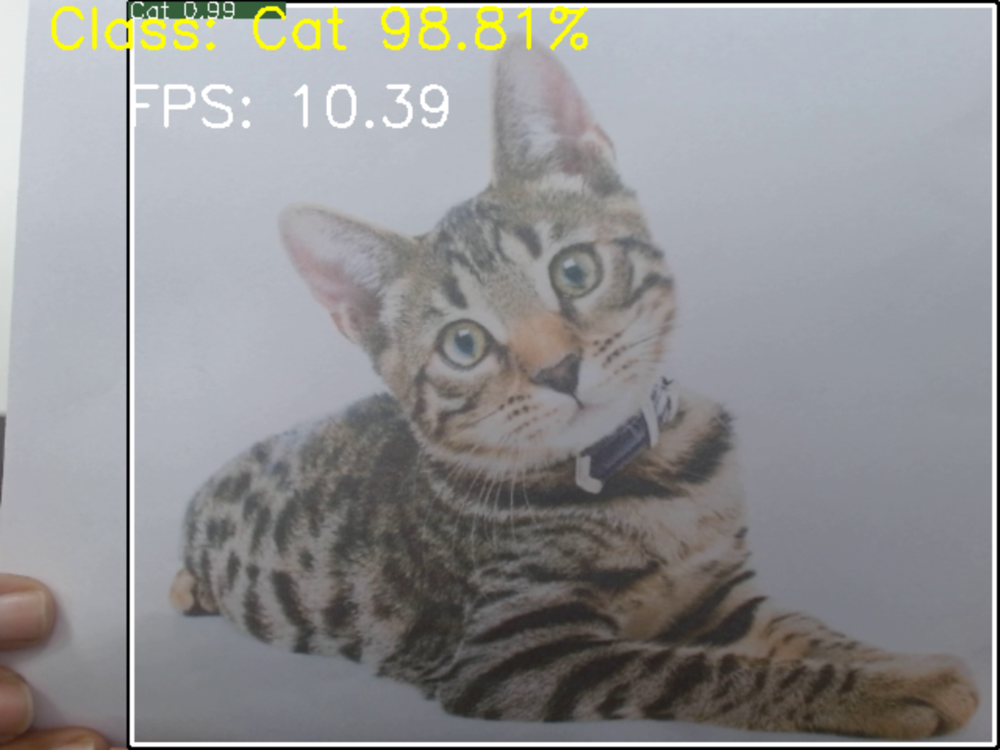

### Kakip Board

### Prerequisites
Ensure the following:
- Complete the [Getting Started](https://renesas-rz.github.io/rzv_ai_sdk/getting_started) instructions provided by Renesas.
- The Kakip board is set up, including the preparation of the SD card.
- The `rzv2h_ai_sdk_image` Docker container is running on the host machine.

### Kakip Board Resources
For additional information on the Kakip board, please refer to:
- **Website**: [Kakip Board Official Website](https://www.kakip.ai/)
- **GitHub Repository**: [Kakip Board GitHub Repository](https://github.com/Kakip-ai/kakip_ai_apps/tree/main)

Refer to the image below for a visual guide to setting up the Kakip board for development: 


#  Head Count Top View Application



This application is used to count the human heads present in a video from Image/camera input.

This repository contains the `11_Head_count_topview` application. Below are the detailed steps for setting up, applying patches, running the application, and building it.

### Step 1: Refer to the SDK Getting Started Guide
Visit the Renesas RZ/V AI SDK [Getting Started](https://renesas-rz.github.io/rzv_ai_sdk/getting_started) Guide for the setup.
### Step 2: Clone the Repository
It is recommended to download/clone the repository on the `data` folder which is mounted on the `rzv2h_ai_sdk_container` docker container as shown below. 
 ```sh
    cd <path_to_data_folder_on_host>/data
    git clone https://github.com/Ignitarium-Renesas/rzv_ai_apps.git
    git clone https://github.com/Ignitarium-Renesas/Kakip_RZV2H_Demos.git
```
> Note 1: Please verify the git repository url if error occurs.

> Note 2: This command will download whole repository, which include all other applications.<br>
     If you have already downloaded the repository of the same version, you may not need to run this command.
### Step 3: Start the Docker Container  
Run (or start) the docker container and open the bash terminal on the container.  
Here, we use the `rzv2h_ai_sdk_container` as the name of container, created from  `rzv2h_ai_sdk_image` docker image.  
    > Note that all the build steps/commands listed below are executed on the docker container bash terminal.  

### Step 4: Set Environment Variables
Set your clone directory to the environment variable.  
```sh
    export PROJECT_PATH=/drp-ai_tvm/data
```
### Step 5: Apply the Patch File
Apply the provided patch file to the application using the command below:

```sh
cd ${PROJECT_PATH}/rzv_ai_apps/11_Head_count_topview/
git apply ../../Kakip_RZV2H_Demos/Head_count_topview/Head_count_topview.patch
```
### Step 6: Navigate to the Application Directory
Move to the source code directory of the application:  
```sh
    cd ${PROJECT_PATH}/rzv_ai_apps/11_Head_count_topview/src
```
### Step 7: Build the Application
Build the application by following the commands below.  

```sh
    mkdir -p build && cd build
    cmake -DCMAKE_TOOLCHAIN_FILE=./toolchain/runtime.cmake -DV2H=ON ..
    make -j$(nproc)
```
### Step 8: Locate the Generated Application
The built application file will be available in the following directory:
 ```sh
    ${PROJECT_PATH}/11_Head_count_topview/src/build
```
The generated file will be named:   
```sh
    head_count_topview_app
```
## Copy the Object File (optional)
###  Running the Program Using the Precompiled Object File
If you prefer to skip the compilation process, you can directly use the precompiled object file included in this repository. This step is useful if you want to quickly run the program without setting up the build environment.

```sh
cp -r ../../Kakip_RZV2H_Demos/Head_count_topview/head_count_topview_app exe_v2h
```

## Application: Deploy Stage
For the ease of deployment all the deployables file and folders are provided on the exe_v2h folder.

|File | Details |
|:---|:---|
|topview_head_count_yolov3 | Model object files for deployment.|
|head_count_topview_app | application file. |

1. Follow the steps below to deploy the project on the board. 
    1. Run the commands below to download the `11_Head_count_topview_deploy_tvm-v230.so` from [Release v5.00](https://github.com/Ignitarium-Renesas/rzv_ai_apps/releases/tag/v5.00)
    ```
    cd ${PROJECT_PATH}/11_Head_count_topview/exe_v2h/topview_head_count_yolov3
    wget https://github.com/Ignitarium-Renesas/rzv_ai_apps/releases/download/v5.00/11_Head_count_topview_deploy_tvm-v230.so
    ```
    2. Rename the `11_Head_count_topview_deploy_tvm-v230.so` to `deploy.so`.
    ```
    mv 11_Head_count_topview_deploy_tvm-v230.so deploy.so
    ```
    3. Copy the following files to the `/home/root/tvm` directory of the rootfs (SD Card) for the board.
        -  All files in [exe_v2h](./exe_v2h) directory. (Including `deploy.so` file.)
        -  `11_Head_count_topview` application file if you generated the file according to [Application File Generation](#application-file-generation)

## Run the Application
To run the application on the Kakip board:

On the board terminal, execute the application with the following command, specifying either USB camera or IMAGE input mode:

- **Image Input**:
    ```sh
    ./head_count_topview_app IMAGE ../img/sample.jpeg
    ```

- **USB Camera Input**:
    ```sh
    ./head_count_topview_app USB
    ```
# Animal detection Application



This application detects animals using a YOLOv3 model and classifies them based on input from a USB camera or an image file.


## Steps Overview

###  **Follow Steps 1–4 from the Head Count Top View Guide:**
- Set up the environment, clone repositories, and configure the Docker container.
- **Ensure** that the `PROJECT_PATH` is set:
```sh
  export PROJECT_PATH=/drp-ai_tvm/data
```

### Step 5: Apply the Patch File
Apply the provided patch file to the application using the command below:

```sh
cd ${PROJECT_PATH}/rzv_ai_apps/07_Animal_detection/
git apply ../../Kakip_RZV2H_Demos/Animal_detection/animal_detection.patch
```
### Step 6: Navigate to the Application Directory
Move to the source code directory of the application:  
```sh
    cd ${PROJECT_PATH}/rzv_ai_apps/07_Animal_detection/src
```
#### Follow Step 7 from the Head Count Top View Guide to build the application
### Step 8: Locate the Generated Application
The built application file will be available in the following directory:
 ```sh
    ${PROJECT_PATH}/07_Animal_detection/src/build
```
The generated file will be named:   
```sh
    animal_detection_app
```
## Copy the Object File (optional)
###  Running the Program Using the Precompiled Object File
If you prefer to skip the compilation process, you can directly use the precompiled object file included in this repository. This step is useful if you want to quickly run the program without setting up the build environment.

```sh
cp -r ../../Kakip_RZV2H_Demos/Animal_detection/animal_detection_app exe_v2h
```
## Application: Deploy Stage
For the ease of deployment all the deployables file and folders are provided on the [exe_v2h](./exe_v2h) folder.

|File | Details |
|:---|:---|
|animal_yolov3_onnx | Model object files for deployment.|
|animal_detection_app | application file. |

1. Follow the steps below to deploy the project on the board. 
    1. Run the commands below to download the `07_Animal_detection_deploy_tvm-v230.so` from [Release v5.00](https://github.com/Ignitarium-Renesas/rzv_ai_apps/releases/tag/v5.00)
    ```
    cd ${PROJECT_PATH}/07_Animal_detection/exe_v2h/animal_yolov3_onnx
    wget https://github.com/Ignitarium-Renesas/rzv_ai_apps/releases/download/v5.00/07_Animal_detection_deploy_tvm-v230.so
    ```
    2. Rename the `07_Animal_detection_deploy_tvm-v230.so` to `deploy.so`.
    ```
    mv 07_Animal_detection_deploy_tvm-v230.so deploy.so
    ```
    3. Copy the following files to the `/home/root/tvm` directory of the rootfs (SD Card) for the board.
        -  All files in [exe_v2h](./exe_v2h) directory. (Including `deploy.so` file.)
        -  `07_Animal_detection` application file if you generated the file according to [Application File Generation](#application-file-generation)

## Run the Application
To run the application on the Kakip board:

On the board terminal, execute the application with the following command, specifying either USB camera or IMAGE input mode:

- **Image Input**:
    ```sh
    ./animal_detection_app IMAGE ../img/sample.jpeg
    ```

- **USB Camera Input**:
    ```sh
    ./animal_detection_app USB
    ```


